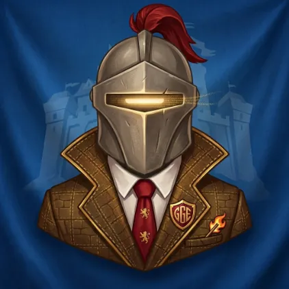
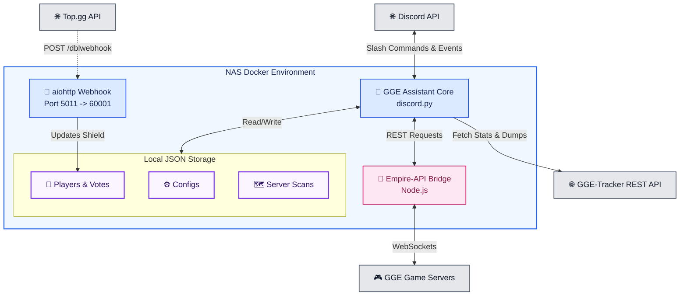

<p align="center">
    
</p>

<p align="center">
    
    
    
    
    
    
    
</p>

<p align="center">
A comprehensive Discord bot designed to assist "Goodgame Empire" (GGE) and "Empire: Four Kingdoms" (E4K) players. It provides server tracking, fortress radars, event management, and automated alerts by leveraging direct game connections and the GGE-Tracker API.
</p>

---

## 🏗️ Main Components

| Component | Stack | Role |
|---|---|---|
| **Bot Core** | `discord.py` | The main application handling commands, events, and background tasks (such as status rotation and radar scanning). |
| **Empire-API Bridge** | `Node.js` | Local REST <=> WebSocket bridge (fork of `danadum/empire-api`) holding persistent connections to the game servers. |
| **Webhook Server** | `aiohttp.web` | Listens for Top.gg upvotes on port 5011 (mapped to 60001) to automatically grant users a 7-day ad-free shield. |
| **Data Storage** | `JSON` | Local flat-file storage for player data, server configurations, and historical server scans. |
| **GGE-Tracker API** | `REST` | External backend API utilized to fetch server map dumps, player metrics, and alliance statistics. |
| **Hosting** | `Docker` | Containerized environment running Python and Node.js, optimized for 24/7 deployment. |

## 📂 Project Structure

<!-- TREE-START -->
```bash
.
├── Dockerfile
├── LICENSE
├── README.md
├── SECURITY.md
├── assets
│   ├── emojis
│   │   ├── 0_.png
│   │   ├── 1_.png
│   │   ├── 2_.png
│   │   ├── 3_.png
│   │   ├── 4_.png
│   │   ├── 5_.png
│   │   ├── 6_.png
│   │   ├── 7_.png
│   │   ├── 8_.png
│   │   ├── 9_.png
│   │   ├── Cake.png
│   │   ├── Carnaval.png
│   │   ├── FloraToken.png
│   │   ├── FrozenCarrot.png
│   │   ├── Information.png
│   │   ├── Le_Hraut_Lumbricus_2.png
│   │   ├── Midnight_key.png
│   │   ├── Moonegg.png
│   │   ├── Orange.png
│   │   ├── Porteurs_de_bouclier.png
│   │   ├── Shapeshifter.png
│   │   ├── alliance.png
│   │   ├── alliance2.png
│   │   ├── alliance_icon.png
│   │   ├── aquamarine.png
│   │   ├── aquamarine_100.png
│   │   ├── aquamarine_15.png
│   │   ├── aquamarine_16.png
│   │   ├── aquamarine_17.png
│   │   ├── aquamarine_18.png
│   │   ├── aquamarine_19.png
│   │   ├── aquamarine_20.png
│   │   ├── aquamarine_brut.png
│   │   ├── aquamarinedepenser.png
│   │   ├── aquamarineforts.png
│   │   ├── aquamarinegagnerjcj.png
│   │   ├── aquamarineiles.png
│   │   ├── aquamarineperdujcj.png
│   │   ├── aquamarinetotalcollectee.png
│   │   ├── attaque.png
│   │   ├── avp.png
│   │   ├── badge.png
│   │   ├── berimond.png
│   │   ├── berimondicon2.png
│   │   ├── bladecoast.png
│   │   ├── bloodcrow.png
│   │   ├── book.png
│   │   ├── bot.png
│   │   ├── bth.png
│   │   ├── burnable.png
│   │   ├── cartography.png
│   │   ├── castle1.png
│   │   ├── castle12.png
│   │   ├── castle22.png
│   │   ├── castle23.png
│   │   ├── castle26.png
│   │   ├── castle28.png
│   │   ├── castle3.png
│   │   ├── castle4.png
│   │   ├── castles.png
│   │   ├── charcoal.png
│   │   ├── chart_down.png
│   │   ├── chart_up.png
│   │   ├── check.png
│   │   ├── ci_appearance_common.png
│   │   ├── ci_appearance_epic.png
│   │   ├── ci_appearance_legendary.png
│   │   ├── ci_appearance_rare.png
│   │   ├── ci_appearance_unique.png
│   │   ├── ci_primary_common.png
│   │   ├── ci_primary_epic.png
│   │   ├── ci_primary_legendary.png
│   │   ├── ci_primary_rare.png
│   │   ├── ci_primary_unique.png
│   │   ├── ci_secondary_common.png
│   │   ├── ci_secondary_epic.png
│   │   ├── ci_secondary_legendary.png
│   │   ├── ci_secondary_rare.png
│   │   ├── ci_secondary_unique.png
│   │   ├── clock.png
│   │   ├── coins.png
│   │   ├── compass.png
│   │   ├── cornerbarleft.png
│   │   ├── cornerbarright.png
│   │   ├── crossbowman.png
│   │   ├── date.png
│   │   ├── deco1.png
│   │   ├── deco2.png
│   │   ├── deco3.png
│   │   ├── deeporangebullet.png
│   │   ├── developer.png
│   │   ├── discordlogo.png
│   │   ├── division1.png
│   │   ├── division2.png
│   │   ├── division3.png
│   │   ├── division4.png
│   │   ├── division5.png
│   │   ├── dungeon0.png
│   │   ├── dungeon1.png
│   │   ├── dungeon2.png
│   │   ├── dungeon3.png
│   │   ├── dungeon4.png
│   │   ├── empirerankings.png
│   │   ├── error.png
│   │   ├── events4.png
│   │   ├── fire.png
│   │   ├── fire2.png
│   │   ├── flagfrench.png
│   │   ├── flaggermany.png
│   │   ├── flagunitedkingdom.png
│   │   ├── food.png
│   │   ├── fortresses.png
│   │   ├── gacha_currency.png
│   │   ├── generalforum.png
│   │   ├── generals.png
│   │   ├── ggelogo.png
│   │   ├── glass.png
│   │   ├── glory.png
│   │   ├── grandtournament.png
│   │   ├── greencirclebullet.png
│   │   ├── guess.png
│   │   ├── guides.png
│   │   ├── help.png
│   │   ├── heritage_hunter.png
│   │   ├── honey.png
│   │   ├── honor.png
│   │   ├── honor2.png
│   │   ├── hover_fusion.png
│   │   ├── hover_publicorder.png
│   │   ├── hover_wood.png
│   │   ├── icon_alliance.png
│   │   ├── icon_analyze.png
│   │   ├── icon_castles.png
│   │   ├── icon_friends.png
│   │   ├── icon_friends2.png
│   │   ├── icon_name.png
│   │   ├── icon_peace.png
│   │   ├── icon_points.png
│   │   ├── icon_search.png
│   │   ├── icon_world.png
│   │   ├── ilesorageuses.png
│   │   ├── kingdomleague.png
│   │   ├── lastpage.png
│   │   ├── league.png
│   │   ├── leagueicon.png
│   │   ├── level.png
│   │   ├── lightcyanbullet.png
│   │   ├── listitem.png
│   │   ├── loot.png
│   │   ├── loot2.png
│   │   ├── loot3.png
│   │   ├── loot4.png
│   │   ├── lootbox.png
│   │   ├── ltpe.png
│   │   ├── lvl.png
│   │   ├── maceman.png
│   │   ├── main.png
│   │   ├── map.png
│   │   ├── maxlevel.png
│   │   ├── mead.png
│   │   ├── medal_bronze.png
│   │   ├── medal_gold.png
│   │   ├── medal_silver.png
│   │   ├── memberlist.png
│   │   ├── memberlistactivity.png
│   │   ├── members.png
│   │   ├── might.png
│   │   ├── moove.png
│   │   ├── movements.png
│   │   ├── moving.png
│   │   ├── newcastle.png
│   │   ├── nextpage.png
│   │   ├── nobility_contest.png
│   │   ├── nocheck.png
│   │   ├── nomadinvasion.png
│   │   ├── nomads.png
│   │   ├── one.png
│   │   ├── outerrealmsicon.png
│   │   ├── parameters.png
│   │   ├── patronage.png
│   │   ├── peace.png
│   │   ├── pinkhearts.gif
│   │   ├── players.png
│   │   ├── podium.png
│   │   ├── pointscargo.png
│   │   ├── pp1.png
│   │   ├── pp2.png
│   │   ├── pp3.png
│   │   ├── publicOrder.png
│   │   ├── ranking.png
│   │   ├── refresh.png
│   │   ├── reinforcedvault.png
│   │   ├── riftraid.png
│   │   ├── ruby.png
│   │   ├── ruins.png
│   │   ├── samurai.png
│   │   ├── samuraiinvasion.png
│   │   ├── search.png
│   │   ├── season.png
│   │   ├── share.png
│   │   ├── shield.png
│   │   ├── sleepy.png
│   │   ├── sparkles.png
│   │   ├── speed.png
│   │   ├── spikeboard.png
│   │   ├── stalwartmarshal.png
│   │   ├── star.png
│   │   ├── stats.png
│   │   ├── status.png
│   │   ├── stone.png
│   │   ├── stormislands.png
│   │   ├── stronghold.png
│   │   ├── three.png
│   │   ├── time.png
│   │   ├── timer.png
│   │   ├── title_0.png
│   │   ├── title_1.png
│   │   ├── title_2.png
│   │   ├── title_3.png
│   │   ├── title_4.png
│   │   ├── title_5.png
│   │   ├── title_level_1.png
│   │   ├── title_level_2.png
│   │   ├── title_level_3.png
│   │   ├── tomatobulletpoint.png
│   │   ├── troop.png
│   │   ├── troops.png
│   │   ├── two.png
│   │   ├── upgradable.png
│   │   ├── upgrade.png
│   │   ├── upgrade2.png
│   │   ├── versus.png
│   │   ├── victoriouscaptain.png
│   │   ├── w2chat_logo.png
│   │   ├── waitingids.png
│   │   ├── war_realms.png
│   │   ├── warning.png
│   │   ├── website.png
│   │   ├── websiteiconfull.png
│   │   ├── websiteiconsquare.png
│   │   ├── whitedot.png
│   │   ├── woa_points.png
│   │   ├── woaicon.png
│   │   ├── wood.png
│   │   ├── words.png
│   │   ├── working.png
│   │   ├── xp.png
│   │   ├── xp2.png
│   │   └── yellowbullet.png
│   ├── github_bannieres
│   │   └── Github_GGE-Assistant_bannière.jpg
│   ├── logo.webp
│   └── profile_pictures
│       ├── GGE Assistant PP.webp
│       ├── GGE-Assistant-WH_Scan.jpg
│       ├── GGE-Assistant-WH_Sync.jpg
│       ├── GGE-Assistant-WH_Vigi.jpg
│       ├── GGE-Assistant_WH_Alert.jpg
│       ├── GGE-Assistant_WH_SJoin.jpg
│       ├── GGE-Assistant_WH_SLeft.jpg
│       ├── GGE-Assistant_WH_Start.jpg
│       ├── GGE-Assistant_WH_Vote.jpg
│       └── beta_gge-assistant_pp.png
├── cogs
│   ├── admin.py
│   ├── aide.py
│   ├── calendrier.py
│   ├── classement.py
│   ├── config.py
│   ├── events.py
│   ├── forteresses.py
│   ├── profils.py
│   ├── radar.py
│   ├── scan_server.py
│   ├── storms.py
│   └── target.py
├── data
│   └── configs
│       ├── configuration.json
│       └── event_mapping.json
├── discord_bot.py
├── docker-compose.yaml
├── emojis.py
├── locales
│   ├── de.json
│   ├── en.json
│   └── fr.json
├── requirements.txt
├── ruff.toml
└── utils.py

9 directories, 288 files
```
<!-- TREE-END -->
*(This section is auto-updated via GitHub Actions)*

The project follows a modular architecture. While some directories are tracked by Git, others are generated automatically at runtime:

**Tracked by Git:**
* **`.github/`**: Contains CI/CD workflows and maintenance scripts (e.g., `strip_comments.py`).
* **`empire-api/`**: Node.js REST API serving as a bridge to the game's WebSockets.
* **`cogs/`**: Contains all feature modules including `forteresses.py`, `radar.py`, `storms.py`, `events.py`, and `classement.py`.
* **`locales/`**: Internationalization files supporting French (`fr.json`), English (`en.json`), and German (`de.json`).
* **`data/configs/`**: Core JSON configurations (`configuration.json`, `event_mapping.json`).

**Locally Generated (Ignored by Git):**
* **`data/`**: The main data store holding `joueurs/` (player tracking, votes) and `server_scans/` (daily dumps for dozens of servers).
* **`.env`**: Stores sensitive API keys, Webhook URL and Discord tokens.
* **`logs/`**: Automated daily rotating logs (`discord_bot.log`) generated by the `TimedRotatingFileHandler`.

## 🤝 Contributing

Contributions, issues, and feature requests are welcome! 
If you want to contribute to the project, please follow these steps:

1. Fork the repository
2. Create your feature branch (`git checkout -b feature/AmazingFeature`)
3. Commit your changes (`git commit -m 'Add some AmazingFeature'`)
4. Push to the branch (`git push origin feature/AmazingFeature`)
5. Open a Pull Request

## 🐛 Support & Feedback

If you encounter any bugs, have feature requests, or need help with the bot:
* Join our [Support Discord Server](https://discord.gg/zrrhxp6wDj)
* Vote for the bot on [Top.gg](https://top.gg/bot/1472309793065533493)
* Open an issue in the [Issues tab](../../issues) of this repository.

## 📄 License

This project is licensed under the Apache License 2.0 - see the [LICENSE](LICENSE) file for details.

## 🚀 Installation & Deployment

The bot is designed to run efficiently via Docker Compose.

```bash
# 1. Clone the repository
git clone https://github.com/nathael-aa/gge-assistant-bot.git && cd gge-assistant-bot

# 2. Configure environment variables
# Requires DISCORD_TOKEN, MON_ID_DISCORD, TOPGG_TOKEN, TOPGG_WEBHOOK_SECRET, WEBHOOK_SYSTEM, WEBHOOK_START, WEBHOOK_JOIN, WEBHOOK_LEAVE, WEBHOOK_VOTES, WEBHOOK_SYNC, WEBHOOK_VIGILANCE and WEBHOOK_SCAN
cp .env.example .env
nano .env

# 3. Start the bot via Docker
docker-compose up -d --build
```

## 🗺️ Architecture Diagram



## ⚖️ License and Legal Disclaimer

The source code of GGE Assistant is licensed under the **Apache License 2.0**. See the `LICENSE` file for more details.

**Third-Party Assets & Copyright:**
* **Goodgame Empire:** This is an unofficial, community-driven project. It is **not affiliated with, endorsed, sponsored, or approved by Goodgame Studios (Altigi GmbH)**. All game assets, icons, concepts, and trademarks related to Goodgame Empire are the exclusive intellectual property of Goodgame Studios.
* **Emojis:** Custom emojis found in the `assets/` folder were sourced from the community platform [emoji.gg](https://emoji.gg). They remain the property of their respective original creators and are strictly excluded from the Apache 2.0 license.
* **Artwork:** The project's visual identity, including the main banner, profile pictures, and logo (`logo.webp`), were generated using Artificial Intelligence.